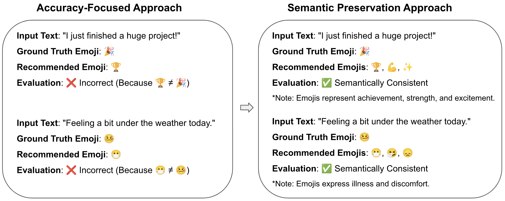

# Semantics Preserving Emoji Recommendation with Large Language Models

[Semantics Preserving Emoji Recommendation with Large Language Models](https://arxiv.org/pdf/2409.10760)

Zhongyu Qiu, Kangyi Qiu, [Hanjia Lyu](https://brucelyu17.github.io/), [Wei Xiong](https://wxiong.me/), [Jiebo Luo](https://www.cs.rochester.edu/u/jluo/)

Accepted for publication in [IEEE BigData 2024](https://www3.cs.stonybrook.edu/~ieeebigdata2024/) 

**Contact**

Hanjia Lyu (hlyu5@ur.rochester.edu), Jiebo Luo (jluo@cs.rochester.edu)




## Citation
```
@article{qiu2024semantics,
  title={Semantics Preserving Emoji Recommendation with Large Language Models},
  author={Qiu, Zhongyi and Qiu, Kangyi and Lyu, Hanjia and Xiong, Wei and Luo, Jiebo},
  journal={arXiv preprint arXiv:2409.10760},
  year={2024}
}
```

## Related Work

[ICWSM 2024] [Human vs. LMMs: Exploring the Discrepancy in Emoji Interpretation and Usage in Digital Communication](https://ojs.aaai.org/index.php/ICWSM/article/view/31453)
