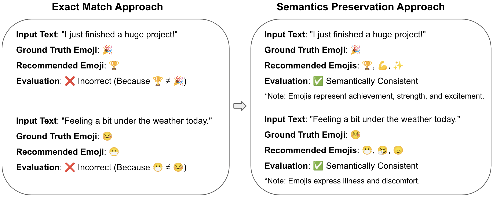

# Semantics Preserving Emoji Recommendation with Large Language Models

[Semantics Preserving Emoji Recommendation with Large Language Models](https://arxiv.org/pdf/2409.10760)

Zhongyi Qiu, Kangyi Qiu, [Hanjia Lyu](https://brucelyu17.github.io/), [Wei Xiong](https://wxiong.me/), [Jiebo Luo](https://www.cs.rochester.edu/u/jluo/)

Accepted for publication in [IEEE BigData 2024](https://www3.cs.stonybrook.edu/~ieeebigdata2024/) 

**Contact**

Hanjia Lyu (hlyu5@ur.rochester.edu), Jiebo Luo (jluo@cs.rochester.edu)





## Environment Setup for Emoji Recommendation Project

### Prerequisites
1. Ensure **Conda** is installed. [Install Conda](https://docs.conda.io/en/latest/miniconda.html) if not already available.
2. Ensure `requirements.txt` is in the same directory as `setup_env.sh`.

### Steps to Set Up the Environment

1. **Run the setup script**:  
   Use the following command to run the setup script:
   ```bash
   bash setup_env.sh
   ```
   Or:
   ```bash
   sh setup_env.sh
   ```
   This creates the emoji_recommendation environment, installs Python 3.10, and installs dependencies from requirements.txt.

2. **Activate the environment**:
    ```bash
   conda activate emoji_recommendation
   ```


## Folder Descriptions

- **Code**:
  - The `src` folder contains all the Jupyter Notebook (`.ipynb`) files used for data preprocessing and running the models. These notebooks handle tasks such as preparing the dataset, running the emoji recommendation models, and evaluating the results.

- **Dataset**:
  - **src/dataset**: Contains the initial raw dataset used for preprocessing and analysis.
  - **src/dataset_finalOutput**: Stores the output results generated by six large language models (LLMs).
  - **src/human_eval**: Includes a small subset of manually labeled data used for evaluating the model predictions.


## Citation
```
@article{qiu2024semantics,
  title={Semantics Preserving Emoji Recommendation with Large Language Models},
  author={Qiu, Zhongyi and Qiu, Kangyi and Lyu, Hanjia and Xiong, Wei and Luo, Jiebo},
  journal={arXiv preprint arXiv:2409.10760},
  year={2024}
}
```

## Related Work

[ICWSM 2024] [Human vs. LMMs: Exploring the Discrepancy in Emoji Interpretation and Usage in Digital Communication](https://ojs.aaai.org/index.php/ICWSM/article/view/31453)

[ACM TIST 2024] [GPT-4V(ision) as A Social Media Analysis Engine](https://arxiv.org/pdf/2311.07547.pdf)

[ICPR 2024] [A Benchmark and Chain-of-Thought Prompting Strategy for Large Multimodal Models with Multiple Image Inputs](https://arxiv.org/pdf/2401.02582.pdf)

[ICME 2024] [Chain-of-Thought Prompting for Demographic Inference with Large Multimodal Models](https://arxiv.org/pdf/2405.15687)

[WWW 2024] [Unifying Local and Global Knowledge: Empowering Large Language Models as Political Experts with Knowledge Graphs](https://brucelyu17.github.io/papers/PEG.pdf)

[ACL 2024] [SoMeLVLM: A Large Vision Language Model for Social Media Processing](https://aclanthology.org/2024.findings-acl.140.pdf)

[COLING 2025] [Evolver: Chain-of-Evolution Prompting to Boost Large Multimodal Models for Hateful Meme Detection](https://arxiv.org/pdf/2407.21004)

